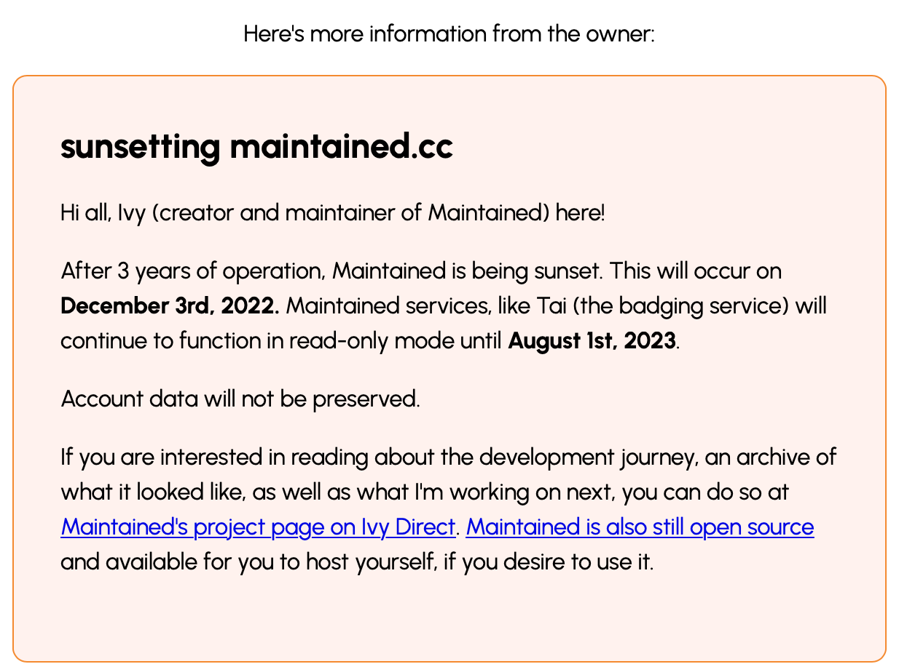
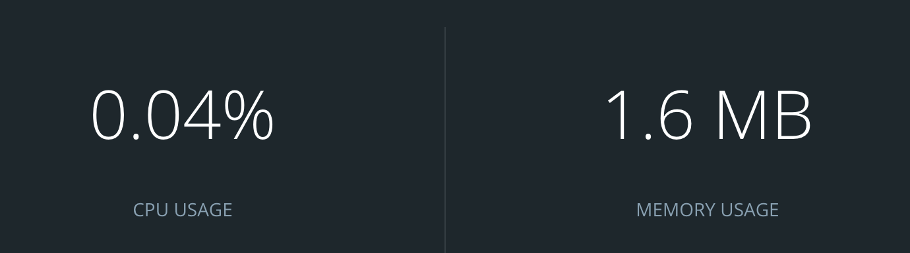

# Sunset

**Sunset** helps you easily and gracefully shut down websites while keeping your users informed.

Sunset can be deployed as a microservice to replace frontend components, to preserve database information past shutdown or background workflows running, keeping your site in a "read-only" mode (precluding API access).

Additionally, you can add custom messages to display to your users in Markdown, with support for most Markdown elements like links and images.

Built using Go, Fiber, and Docker, Sunset uses almost no resources and can be run with minimal server impact.

## How to deploy a Sunset instance

1. Clone this repository
2. Edit `public/message.md` with appropriate message for users
3. `docker build -t sunset:website .`
4. `docker run -p 3000:3000 -d sunset:website`
5. Edit your reverse proxy for your domain to point at `localhost:3000` on your server